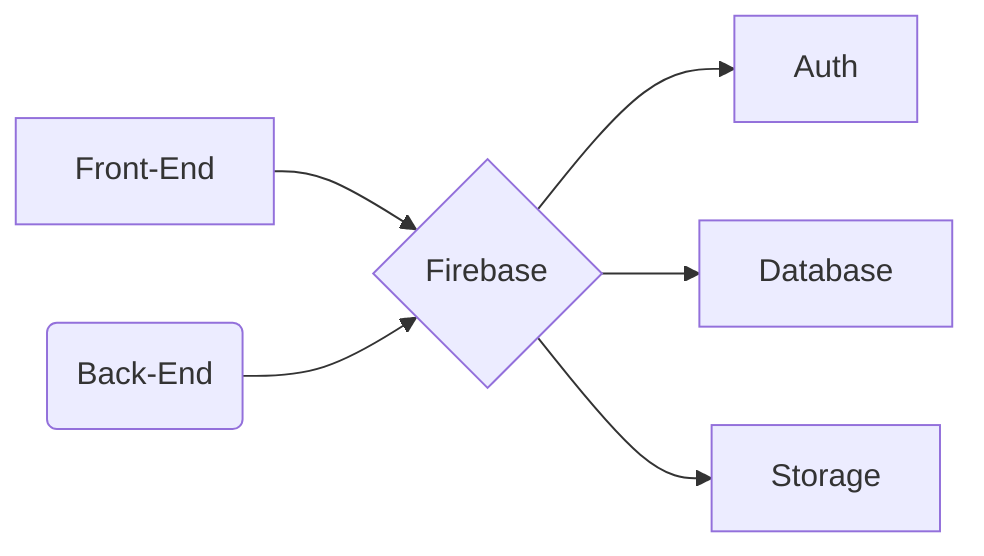

```
flowchart LR
A[Inicio] -->|Firebase| B(Database)
B --> |Python| C{API}
C -->|Javascript| D[Front-End]
C -->|Python| E[Back-End]
E --> |Python| F[Login]
D -->|Javascript| G[Login]
D -->|Javascript| H[Manager]
E --> |Python| I[Manager]
```

