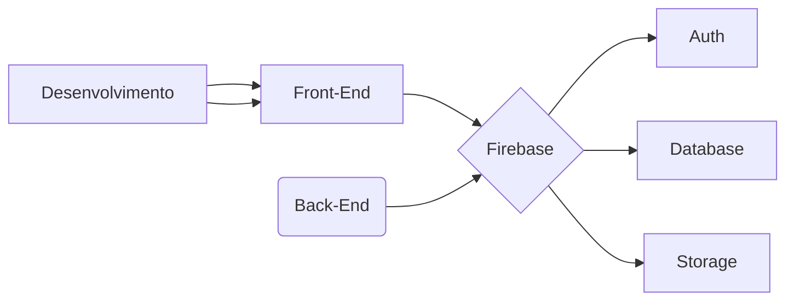

```
flowchart LR
A[Front-End] --> C{Firebase}
B(Back-End) --> C{Firebase}
C --> D[Auth]
C --> E[Database]
C --> F[Storage]
```

```mermaid
flowchart LR
Z[Desenvolvimento] --> A[Front-End]
Z  --> A
A[Front-End] --> C{Firebase}
B(Back-End) --> C{Firebase}
C --> D[Auth]
C --> E[Database]
C --> F[Storage]
```
